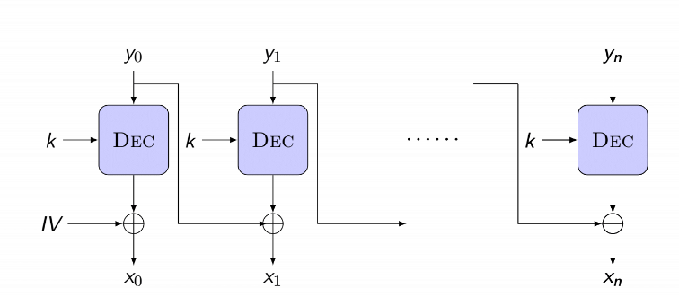
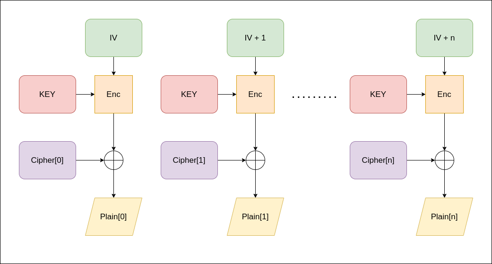

# Cài đặt AES với chế độ CBC (Cipher block chaining) và CTR (Counter mode)

> Bài tập chỉ yêu cầu cài đặt phần giải mã

## Cách cài đặt

### [CBC mode](https://github.com/thanhpp/HUST/tree/main/MMVUD/project3/cbcmode)
- Sơ đồ giải mã
  - 
- Giải thích thuật toán
  - Decode hexa về binary của ciphertext, và key
  - Gỡ IV được thêm vào tại đầu của ciphertext (sizeIV == sizeBlock)
  - Sử dụng bộ giải mã AES (với key cho trước), giải mã từng block của ciphertext
  - Với mỗi block giải mã được
    - Block đầu tiên, XOR với IV
    - Các Block tiếp theo, XOR với block ciphertext trước nó
  - Sử dụng PCK5Padding để bỏ đi các ký tự thừa

### [CTR mode](https://github.com/thanhpp/HUST/tree/main/MMVUD/project3/ctrmode)
- Sơ đồ giải mã
  - 
- Giải thích thuật toán
  - Decode hexa về binary của ciphertext, và key
  - Gỡ IV được thêm vào tại đầu của ciphertext (sizeIV == sizeBlock)
  - Với mỗi block của ciphertext
    - Mã hóa IV bằng bộ giải mã AES (với key cho trước)
    - XOR giá trị IV đã mã hóa với block của ciphertext, thu được một block của plaintext
    - Tăng giá trị IV lên 1 đơn vị

## Tham khảo
- https://www.dropbox.com/sh/zcbe74d19cyc5tv/AAB65O49wKKTQrXMQpfDNsyXa/slides?dl=0&preview=06modesOfOperation.pdf&subfolder_nav_tracking=1
- https://xilinx.github.io/Vitis_Libraries/security/2020.1/guide_L1/internals/ctr.html