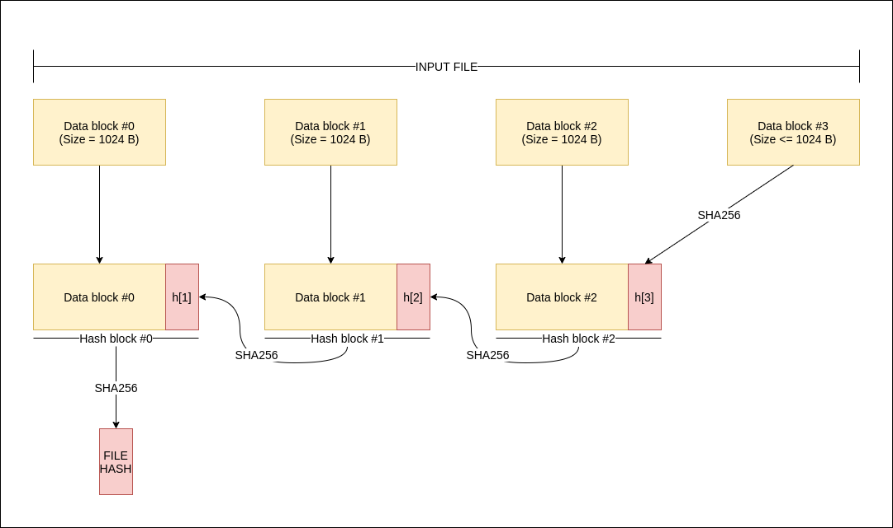

# Hash File sử dụng SHA 256

- [Hash File sử dụng SHA 256](#hash-file-sử-dụng-sha-256)
  - [Quy trình Hash](#quy-trình-hash)
  - [Mô tả cách sử dụng chương trình](#mô-tả-cách-sử-dụng-chương-trình)
    - [Build](#build)
    - [Tính năng](#tính-năng)
      - [Hash file](#hash-file)
      - [So sánh file](#so-sánh-file)
      - [So sánh file với giá hash có sẵn](#so-sánh-file-với-giá-hash-có-sẵn)

## Quy trình Hash
- Sử dụng phương pháp hash SHA256
- Chia nhỏ 1 file thành các block 
    - Mỗi **data block** có kích thước: 1024 bytes ~ 1 KB
    - Với **data block**  cuối cùng của file có kích thước: <= 1024 bytes
- Cách tính giá trị hash của file
    - Tính hash từ **data block**  cuối cùng
    - Lấy **data block**  hiện tại, gộp với giá trị hash của **data block** sau, tạo thành _**hash block**_ mới
    - Tính giá trị hash của _**hash block**_ mới
    - Giá trị hash của file là giá trị hash của (**data block** đầu tiên + hash của _**hash block**_ thứ 2)



## Mô tả cách sử dụng chương trình
### Build
```bash
$ go mod init
$ go mod tidy
$ go build
```

```
$ ./project4 -h
project4 is a tool to calculate the hash of a file or compare file and hashes

Usage:
  project4 [command]

Available Commands:
  calhash      calculate the hash of files
  comparefiles compare the hash of 2 files
  comparehash  compare the hash of a file with an expected hash
  completion   Generate the autocompletion script for the specified shell
  help         Help about any command

Flags:
  -h, --help   help for project4

Use "project4 [command] --help" for more information about a command.
```

### Tính năng
#### Hash file
```bash
$ ./project4 calhash [File 1] [File 2] [File 3]
``` 

```
$ ./project4 calhash birthday.mp4 main.go

2021/12/29 02:01:49 file name: birthday.mp4
2021/12/29 02:01:49 hash: 03c08f4ee0b576fe319338139c045c89c3e8e9409633bea29442e21425006ea8
2021/12/29 02:01:49 file name: main.go
2021/12/29 02:01:49 hash: 8f80d0f97af88f8a496b65241801a7457bb025bdfae40e62210107ae74d6158f
```

#### So sánh file
```bash
$ ./project4 comparefiles [File 1] [File 2]
```

```
$ ./project4 comparefiles birthday.mp4 main.go

2021/12/29 02:02:46 file name: birthday.mp4
2021/12/29 02:02:46 hash: 03c08f4ee0b576fe319338139c045c89c3e8e9409633bea29442e21425006ea8
2021/12/29 02:02:46 file name: main.go
2021/12/29 02:02:46 hash: 8f80d0f97af88f8a496b65241801a7457bb025bdfae40e62210107ae74d6158f
2021/12/29 02:02:46 file1 hash == file2 hash: false
```

#### So sánh file với giá trị hash có sẵn
```
$ ./project4 comparehash --expected=[expected hash] [File]
```

```
$ ./project4 comparehash --expected=03c08f4ee0b576fe319338139c045c89c3e8e9409633bea29442e21425006ea8 birthday.mp4

2021/12/29 02:04:36 file name: birthday.mp4
2021/12/29 02:04:36 hash:          03c08f4ee0b576fe319338139c045c89c3e8e9409633bea29442e21425006ea8
2021/12/29 02:04:36 expected hash: 03c08f4ee0b576fe319338139c045c89c3e8e9409633bea29442e21425006ea8
2021/12/29 02:04:36 file hash == expected hash: true
```
